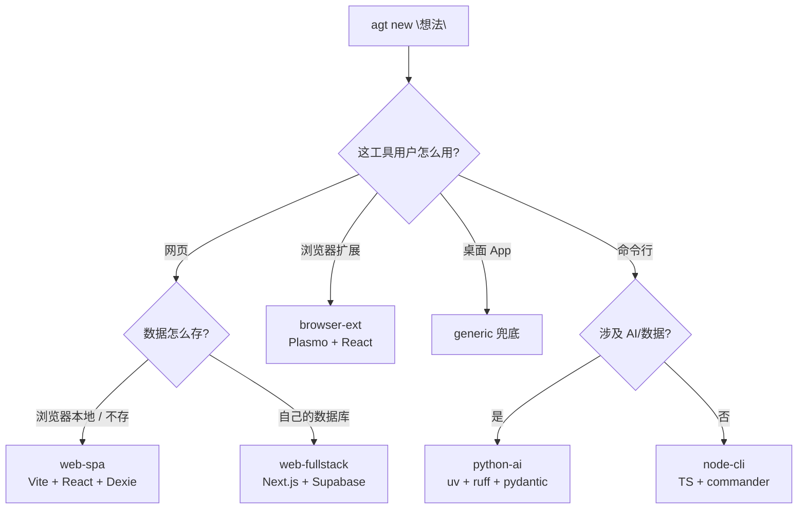

# AgentGuard

> 一句话开项目，自带 AI 专家级工程姿势。
> One-liner to bootstrap an AI-friendly project — with expert engineering posture built in.

从想法到能写代码的项目，只要 30 秒。AgentGuard 帮普通人像独立开发者老手一样用 AI 写代码：自动建独立目录、自动选 2026 年最优工程架构、自动写定制 `AGENTS.md`，并把危险命令拦截 / 密钥扫描 / 自动快照等护栏全部配好——你不需要单独学。

---

## 30 秒上手 / 30-second start

```bash
npx agt new "我想做一个 B 站浏览记录管理"
```

```
🤔 3 个问题（10 秒）→ 🚀 选定架构 → ✨ 项目就绪
  ✓ ~/AI-Projects/bilibili-history-manager/
  ✓ Vite + React 19 + TypeScript + Tailwind v4 + Dexie
  ✓ 定制 AGENTS.md（针对你的场景的规则）
  ✓ CLAUDE.md / .cursorrules / .clinerules / .trae/rules.md（软链接）
  ✓ git init + 首次 commit
  ✓ 4 个防御 hooks（危险命令 / secrets / 自动 checkpoint / pre-commit）
```

之后：

```bash
cd ~/AI-Projects/bilibili-history-manager
cursor .          # 或 claude / trae
# 对 AI 说："读 AGENTS.md，然后开始做"
```

---

## 安装 / Installation

需要 **Node.js 20+**。三种方式任选其一：

### 方式 1：免安装（推荐试用）

```bash
npx agt new "番茄钟网页"
```

`npx` 会临时下载并运行，最省事，适合偶尔用。

### 方式 2：全局安装（推荐长期使用）

```bash
npm i -g agt
agt --version     # 验证安装成功
agt new "番茄钟网页"
```

### 方式 3：从源码本地安装（开发 / 还没发布到 npm 时）

```bash
git clone https://github.com/kentdu1996/agt.git
cd agt
npm install
npm run build     # 编译 TypeScript + 拷贝模板到 dist/
npm link          # 把 `agt` 命令注册到全局
agt --version
```

> 卸载：`npm rm -g agt`（或源码方式用 `npm unlink -g agt`）。

---

## 它做了什么 / What it does

`agt new "<想法>"` 执行 9 步：解析想法生成项目名 → 决定目录 → 问最多 3 个问题 → 路由到最优架构 → 创建目录 → 跑脚手架 → 生成 `AGENTS.md` 与规则文件 → 安装防御 + git → 输出下一步。全程**不调用任何 LLM**，纯本地规则引擎，结果可预测。

### 架构决策树



## 5 种内置架构 / Built-in architectures

| 架构 | 脚手架 | 何时选 |
|---|---|---|
| **web-spa** | Vite + React 19 + TS + Tailwind v4 + Dexie | 网页 + 本地数据 + 一个人 |
| **web-fullstack** | Next.js 15 + TS + Tailwind + Supabase | 网页 + 云数据库 + 多人 |
| **browser-ext** | Plasmo + React + TS + Tailwind | 浏览器扩展 |
| **python-ai** | uv + Python 3.12 + ruff + pydantic + openai | 命令行 + AI/数据 |
| **node-cli** | Node 20 + TS + commander + chalk | 命令行 + 通用工具 |
| _generic_ | 仅规则文件 + git | 以上都不匹配（兜底） |

不匹配时一律回退到 `generic`，保证 100% 能用。

## 防御能力（自动配好，你不需要学）/ Guardrails (auto-configured)

每个 `new` 出来的项目都自动带 4 件套，作为副产品：

- 🛑 **危险命令拦截** — `rm -rf /`、`git push -f main`、`drop database`… 执行前拦下
- 🔑 **Secrets 扫描** — pre-commit / pre-read / pre-write 三处拦截 + `scan` / `fix --secrets`
- ⏪ **自动快照** — Agent 动手前用隐藏 git ref 快照，`rollback` 一键恢复（不污染 `git log`）
- ✅ **pre-commit** — 阻止把密钥提交进 git

## 给 Claude Code 用户 / For Claude Code users

`agt new` 生成项目时会自动写好两样 Claude Code **原生认识**的东西，无需手动配置：

1. **`CLAUDE.md`**（软链到 `AGENTS.md`）—— Claude Code 打开项目自动读，等于把专家级规则直接装进它脑子。
2. **`.claude/settings.json` 的 PreToolUse hooks** —— Claude 每次执行 Bash / Read / Write / Edit **之前**都先过一遍 AgentGuard 脚本，危险操作当场拦下。

### 典型流程

```bash
agt new "我想做一个本地番茄钟网页"   # 答 3 个问题，自动选 Vite+React+Dexie
cd ~/AI-Projects/pomodoro
claude                              # 启动 Claude Code
```

然后对 Claude 说：**“读 AGENTS.md，然后开始做番茄钟的核心计时功能”**。
Claude 会按你定的工程姿势写代码（如「禁止引入 Redux，状态用 useState/Context」「数据用 Dexie 不用 localStorage」），而不是自由发挥装一堆过时依赖。

### 后台自动生效的护栏（你正常对话即可）

| 场景 | AgentGuard 的反应 |
|---|---|
| Claude 想跑 `rm -rf` / `git push -f main` | Bash 调用被 exit code 2 拦下，命令不执行，Claude 看到原因后改用安全做法 |
| Claude 想 `cat .env` 把密钥读进上下文 | pre-read hook 拦下（这是 Claude/Cursor 聊天记录泄密的根因）|
| Claude 想把 `sk-xxx` 硬编码进代码 | pre-write hook 拦下，提示改用 `process.env.*` |
| 你 `git commit` 误带密钥 | pre-commit hook 拦下 |
| Claude 把代码改崩了 | `agt rollback` 回到它动手前的快照（即使你没手动 commit）|
| 误拦了一条安全命令 | `agt allow "那条命令"` 加白名单 |

> 心智模型：用了 `agt` 之后在 Claude Code 里**正常写代码就行**，护栏「你忘了它存在，但它一直在」。

## 已有项目? / Existing project?

```bash
agt init       # 退居二线的旧入口：给已有项目加上护栏
```

## 命令清单 / Commands

| 命令 | 功能 |
|---|---|
| `agt new <idea>` | 一句话开新项目（`--here` / `--name` / `--arch` / `--yes` / `--dry-run`）|
| `agt init [dir]` | 给已有项目加护栏 |
| `agt doctor` | 项目健康体检（0–100 分）|
| `agt scan [path]` | 扫描硬编码密钥 |
| `agt fix --secrets` | 自动脱敏 |
| `agt rollback` | 回滚到自动快照 |
| `agt allow <pattern>` | 添加命令白名单 |
| `agt hooks install\|uninstall` | 管理 hooks |

`AGENTGUARD_LANG=en` / `zh` 可强制界面语言（默认按 `LANG` 自动检测）。

## 常见问题 / FAQ

**会调用 LLM 或上传数据吗？** 不会。纯本地治理层，无网络访问、无遥测。

**项目放哪？** 默认 `~/AI-Projects/`，首次运行问你一次后记住；`--here` 可建在当前目录。

**架构选错了？** `--arch <id>` 强制指定，或在问答里改。

**Windows？** symlink 自动回退为文件复制。

**AGENTS.md 会不会太长？** 硬上限 250 行，避免污染 AI 上下文窗口。

## 路线 / Roadmap

- v2.1 — Tauri / Flutter / Rust 架构；`agentguard upgrade`（为已有项目升级 AGENTS.md）
- v3.0 — MCP Server / VS Code 扩展 / Web Dashboard

## License

MIT
